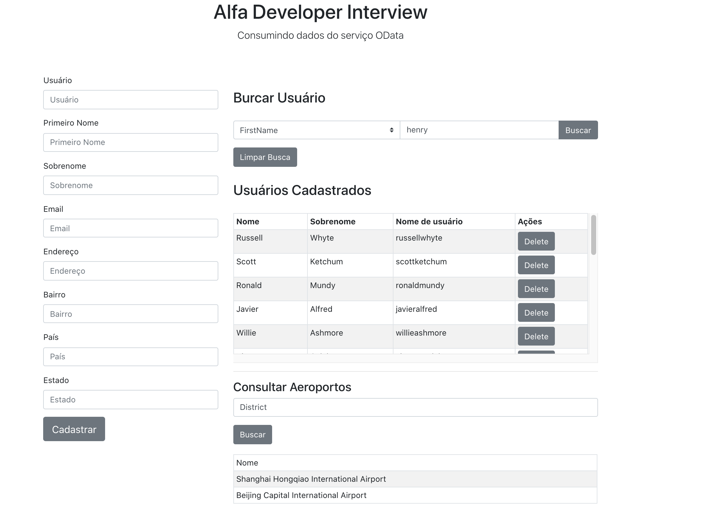

<h4 align="center"> 
    (Teste)-Alfa Developer Interview
</h4>

## :rocket: Tecnologias
Este projeto foi desenvolvido com as seguintes tecnologias
 
- [Node.js](https://nodejs.org/en/) 
- [React](https://reactjs.org)


## :page_with_curl: Como Usar
- **Clone o repositório**
- **backend** 
    - ```cd backend```
    - ```yarn```
    - ```yarn dev``` `
    
- **Front-end** 
    - ```cd web```
    - ```yarn```
    - ```yarn start``` `

## :computer: Front-End Web :heavy_check_mark:

<h1 align="center">
    
</h1>

## :memo: License

Esse projeto está sob a licença MIT. Veja o arquivo [LICENSE](LICENSE) para mais detalhes.


# DEVELOPER INTERVIEW

Este teste tem como objetivo não apenas enteder o conhecimento técnico do candidato com linguagem A, B ou C, mas também sua capacidade de:
* ***ler documentações***
* ***entender e executar o que está sendo solicitado***
* ***solucionar problemas***
* ***organizar o código***

Além de é claro ***conhecer a qualidade, legibilidade do código, as suas escolhas técnicas e a lógica utilizada***.

Para enviar seu teste basta forkar esse repositório e criar o seu projeto (ou workspace) usando a sua versão desse repositório, tão logo acabe o teste, submeta um pull request.


# VAMOS LÁ?

### [OData.org](https://www.odata.org/)
>**OData (Open Data Protocol)** é um padrão OASIS aprovado pela ISO / IEC que define um conjunto de práticas recomendadas para criar e consumir APIs RESTful. 

>O **OData** ajuda você a se concentrar na lógica de negócios enquanto cria APIs RESTful sem se preocupar com as várias abordagens para definir cabeçalhos de solicitação e resposta, códigos de status, métodos HTTP, convenções de URL, tipos de mídia, formatos de carga útil, opções de consulta etc. 

>O **OData** também fornece orientação para rastrear alterações, definir funções / ações para procedimentos reutilizáveis e enviar solicitações assíncronas / em lote.

Usando uma linguagem de programação de sua preferência, consuma os dados [deste serviço padrão OData](https://services.odata.org/TripPinRESTierService/(S(kgoeuh1x0jveff0efe4lodbl))/) executando as operações:

Referência [OData Services](https://www.odata.org/odata-services/)

- [X] Consultar ***nome*** e ***sobrenome*** das ***pessoas*** com ***nome de usuário*** que contenha ***Henry***
- [X] ***Incluir*** uma pessoa
- [X] ***Excluir*** a pessoa que você incluiu acima
- [X] Consultar todos os aeroportos que o ***endereço da localização*** contenha a palavra 'District'

